# 2. 6 channel knob servo controller

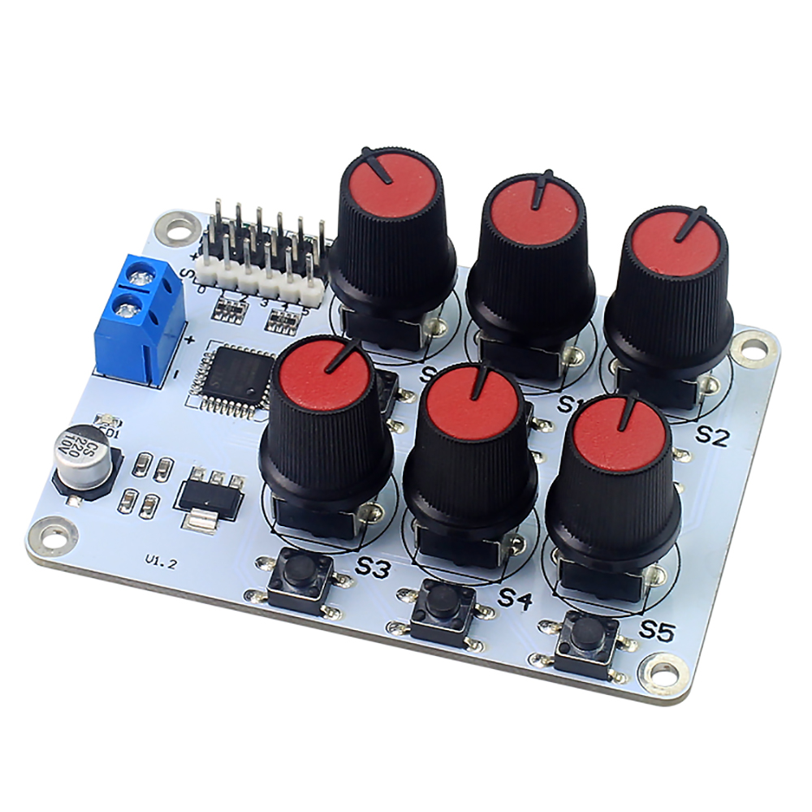

## 2.1 Overview

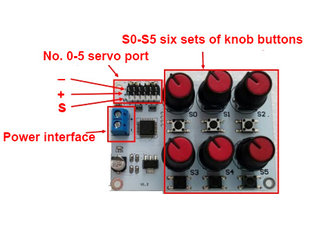

The working voltage range of 6 channel knob servo controller(controller) is 5V-8.4V. Users can select the power supply to supply power to the controller according to the voltage required by the servos. Excessive voltage can damage the controller and servo, causing some unresolved faults. In this paper, a 7.4V lithium battery is used as the power source.

## 2.2 wiring

:::{Note}

Using the 7.4V lithium battery, if it is used to control our company's `LDX-218` and `LDX-227` servos, see section B directly.
:::

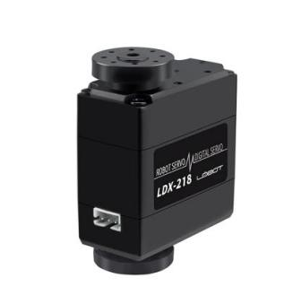

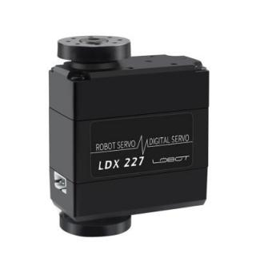

If it is used to control other standard servos, please decide whether to use the step-down chip according to the nominal parameters such as its rated voltage. The step-down chip can provide a voltage drop of 1.4V. If it is used to control mechanical arm, it must be connected to the step-down chip.Please refer to part A for the wiring diagram of the step-down chip.

### 2.2.1 Part A (Buck Chip Connection)

Using a buck chip to connect the controller to the battery:

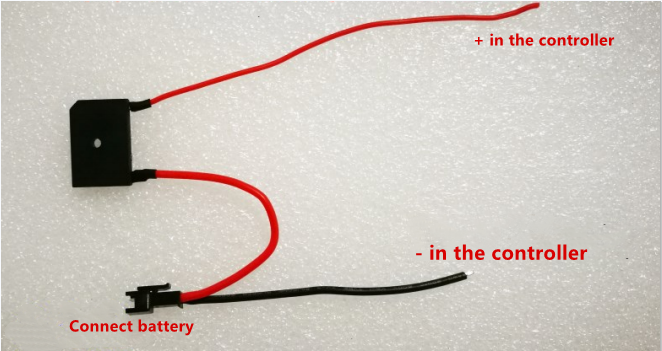

The buck chip is installed to the Controller, the red line corresponds to the Blue power supply terminal of the controller `+` interface, and the black line corresponds controller Blue Power Terminal `-` interface. The servo is inserted into the servo socket of the controller, and the `+`, `-`, `s` should correspond to each other, as shown in figure:

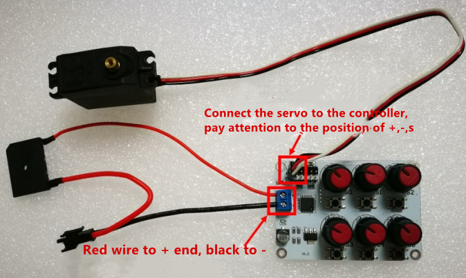

Then connect the battery and the power indicator on the controller lights up after power-on. As shown below:

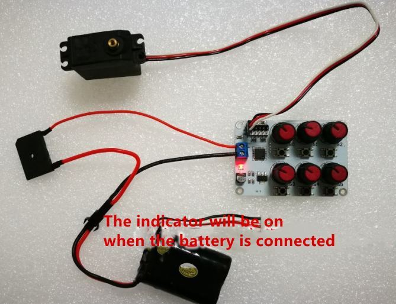

### 2.2.2 Part B: Using power-pair wiring to connect the controller to the battery

The power supply wiring is as shown:

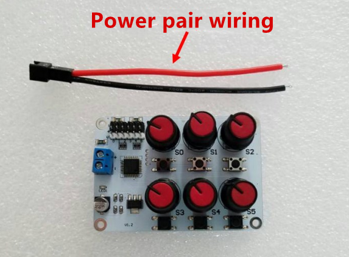

We should install the power supply wiring to the controller, the red line corresponds to the `+` interface of the blue power supply terminal of the controller, and the black line corresponds to the control blue power terminal `-` interface. Insert the servo into the servo jack of the controller. The `+`, `-`, `s` should be one-to-one correspondence, as shown in the figure:

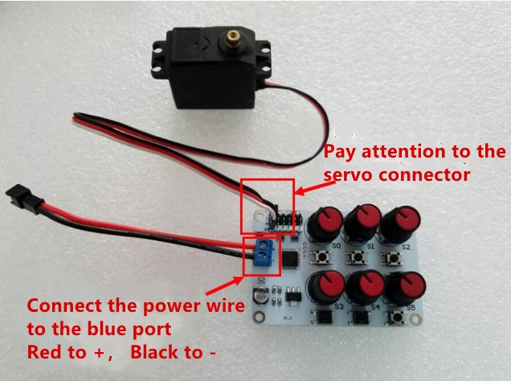

Then connect the battery and the power indicator on the controller lights up after power-on. As shown below:

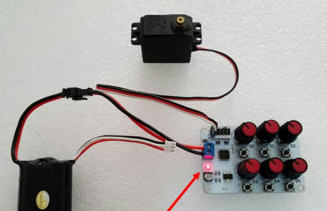

## 2.3 Operation

Rotate the knob with the corresponding number of the port number. If the servo is inserted into the 0-position jack, rotate the `S0` knob, and the rudder will rotate with the rotation of the knob.

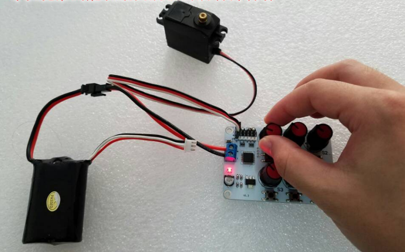

Press the button of the corresponding number servo on the controller.For example, if the servo is connected to the No.0 port, please press the `S0` button, then the servo will rotate to the `1500` position, which is the middle position. It's in the middle at the servo rotation range. At this situation, the `S0` knob doesn't work until the middle button is pressed again, and the knob control will be restored.And the servo will rotate to the setting position of the knob.

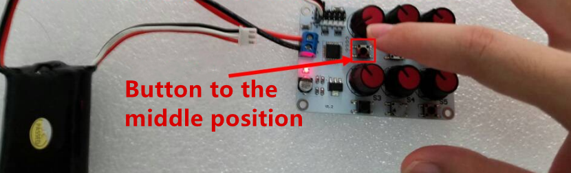